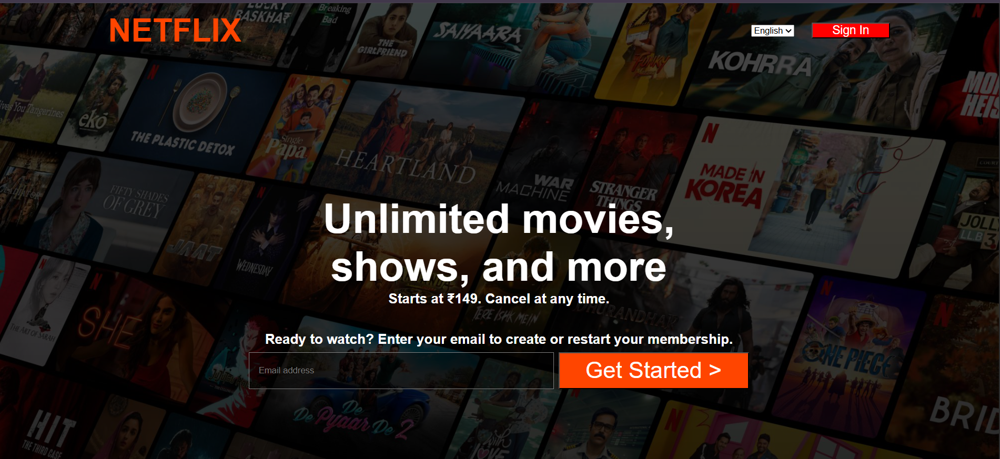
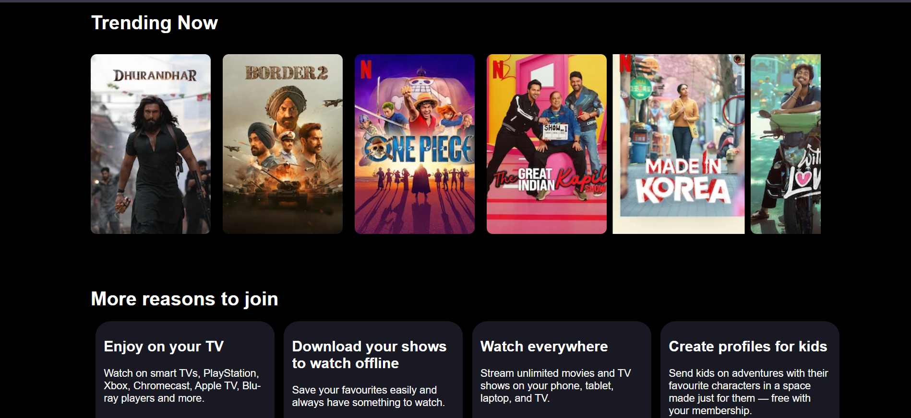
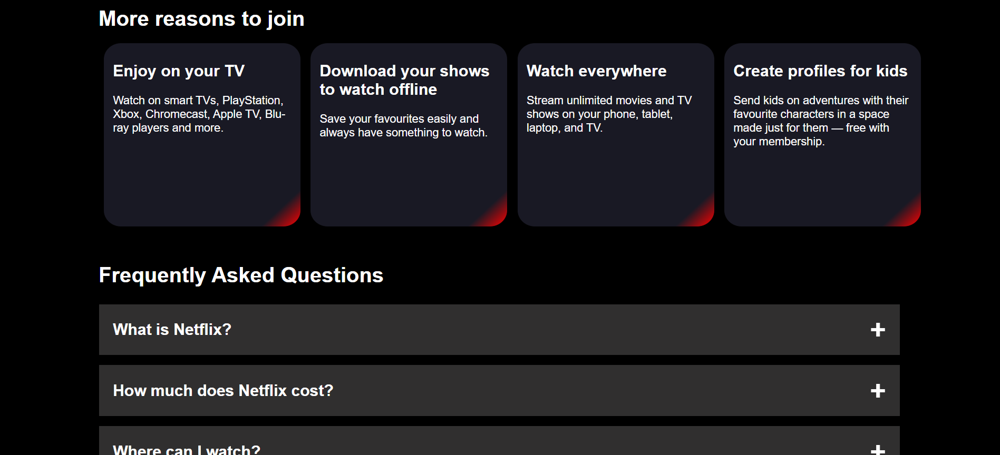
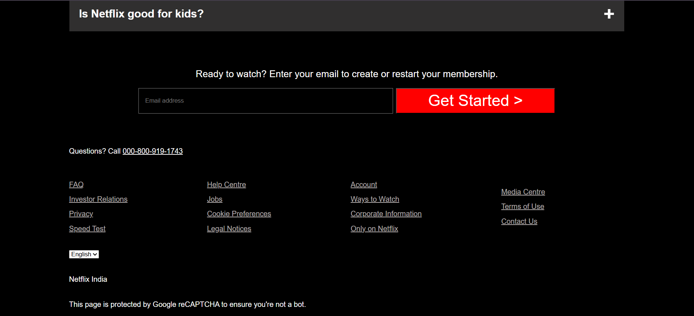
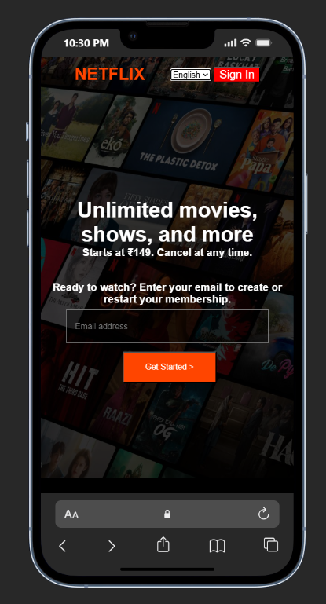
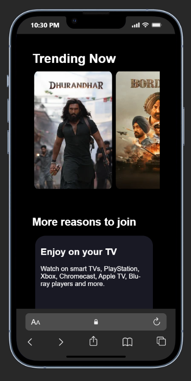
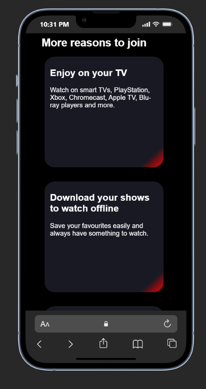
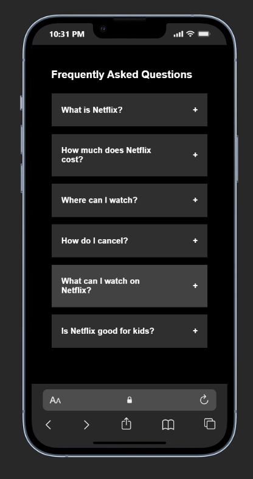
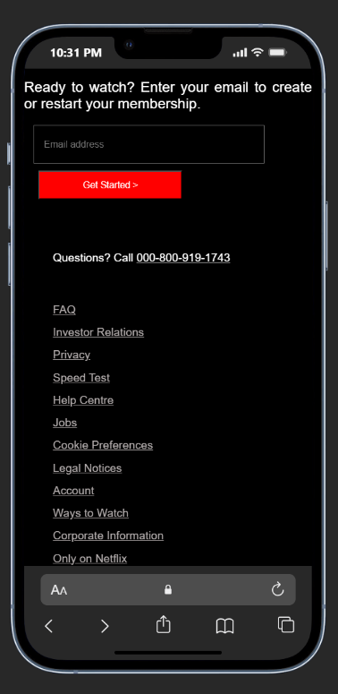

# 🎬 Netflix Landing Page Clone

A responsive **Netflix Landing Page Clone** built using **HTML5** and **CSS3**. This project recreates the design of the Netflix homepage with a modern UI, responsive layout, horizontal movie slider, membership section, FAQ section, and footer.

---

## 🚀 Live Demo

🔗 https://sachin-netfli-x-clone.netlify.app/


---

## 📸 Project Preview

### 💻 Desktop View

| Home Page | Trending Movies |
|-----------|-----------------|
|  |  |

| Membership Section | FAQ Section |
|-------------------|-------------|
|  |  |

---

### 📱 Mobile View

| Mobile-1 | Mobile-2 |
|----------|----------|
|  |  |

| Mobile-3 | Mobile-4 |
|----------|----------|
|  |  |

| Mobile-5 |
|----------|
|  |

---

## ✨ Features

- 🎥 Netflix-inspired landing page
- 📱 Fully responsive design
- 🌄 Hero section with background image
- 🎬 Horizontally scrollable Trending Movies section
- 📺 "More Reasons to Join" section
- ❓ Frequently Asked Questions (FAQ)
- 📧 Email subscription section
- 🔗 Footer with multiple navigation links
- 🎨 Smooth hover animations
- 📱 Mobile-friendly layout using Media Queries

---

## 🛠️ Technologies Used

- HTML5
- CSS3
- Flexbox
- CSS Grid
- Media Queries
- Responsive Web Design

---

## 📂 Folder Structure

```text
NETFLIX_PAGE/
│
├── images/
│   ├── border2.webp
│   ├── durandar.webp
│   ├── netflixbackgroundimage.jpg
│   ├── one piece.webp
│   ├── netflix-desktop-1.png
│   ├── netflix-desktop-2.png
│   ├── netflix-desktop-3.png
│   ├── netflix-desktop-4.png
│   ├── netflix-mobile-1.png
│   ├── netflix-mobile-2.png
│   ├── netflix-mobile-3.png
│   ├── netflix-mobile-4.png
│   └── netflix-mobile-5.png
│
├── index.html
├── style.css
└── README.md
```

---

## 📱 Responsive Design

This project is fully responsive and optimized for:

- 💻 Desktop
- 📱 Mobile


using CSS Media Queries.

---

## 🎯 Learning Outcomes

Through this project, I improved my understanding of:

- HTML5 Semantic Structure
- CSS Flexbox
- CSS Grid
- Responsive Web Design
- Media Queries
- Background Images
- Hover Effects
- Layout Design
- UI Cloning
- Mobile-First Thinking

---

## 🔮 Future Improvements

- Add JavaScript functionality for FAQ toggle
- Add movie slider buttons
- Improve animations
- Dark mode enhancements
- Authentication page
- Backend integration

---

## 👨‍💻 Author

**Sachin K**

- GitHub: https://github.com/Sachin-K-0672
- Portfolio: https://ksachin.netlify.app/

---


## 📄 Disclaimer

This project was created for **learning and educational purposes only**. It is a front-end clone inspired by Netflix and is not affiliated with or endorsed by Netflix.
